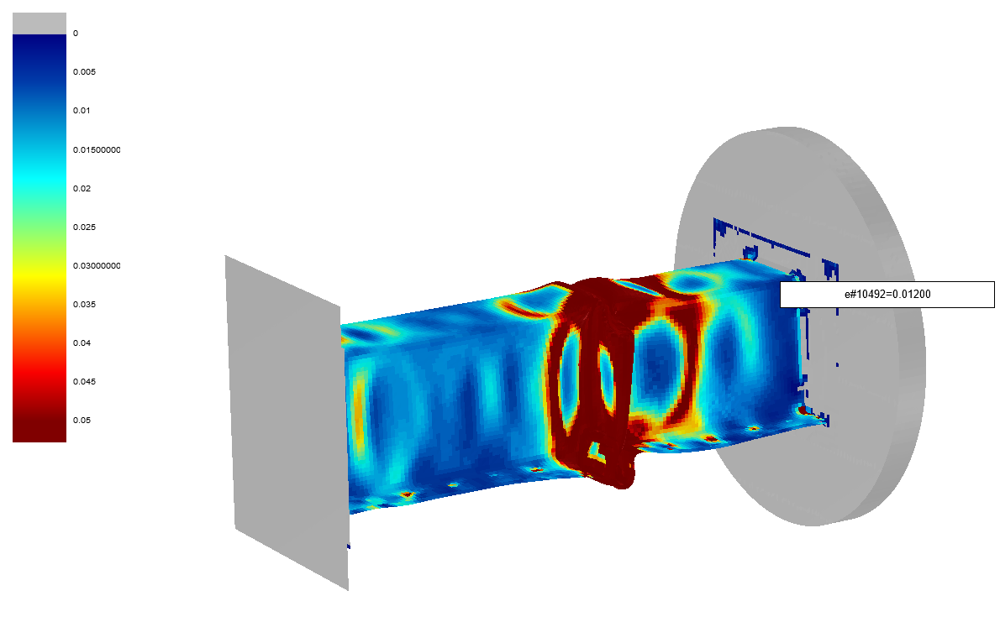

# Module qd.cae.dyna

The module contains functions and classes for the FEM-Solver LS-DYNA. This project is not affiliated in any way with the creators or distributors of LS-Dyna and thus is totally unofficial.

The core-code is written entirely in C++ with a python wrapper. Even though the code is being validated with big effort, there always may be mistakes and bugs. The reader is very touchy in terms of checks, so if anything will go wrong during reading, an exception will be thrown.

-----------
# Overview:

[Example](#example)

Classes:
- [Binout](#binout)
- [D3plot](#d3plot)
- [KeyFile](#keyfile)
- [FEMFile (D3plot & KeyFile)](#femfile-d3plot-keyfile)
- [Node](#node)
- [Element](#element)
- [Part](#part)

Functions:
- plot_parts

[FAQ](#faq)


-----------------
# Videos

[](https://www.youtube.com/watch?v=w8qIzqPJ4VY "Reading a D3plot (LS-Dyna) in Python with \"qd\"")

[](https://www.youtube.com/watch?v=P96Vkuvg02w&list=PLUNAZ7gxTEATtRTFt_nofPcn3m6PBiT2Y&index=2&t=2s "Reading a Binout (LS-Dyna) in Python with \"qd\"")

---------
# Example

```python
from qd.cae.dyna import Binout, D3plot

# D3plot
d3plot = D3plot("filepath/to/d3plot",read_states="disp")
timesteps = d3plot.get_timesteps()
d3plot.read_states(["plastic_strain max","history 2 shell max"])

# Node
node = d3plot.get_nodeByID(7)
node_displacement = node.get_disp()

# Element
element = d3plot.get_elementByID("shell",11)
elem_plastic_strain = element.get_plastic_strain()
for node in element.get_nodes():
  print("Node:"+str(node.get_id()))

# Part
part = d3plot.get_partByID(13)
part_elems = part.get_elements()

# Binout
binout = Binout("filepath/to/binout")
binout.read()
# >>> ['nodout']
binout.read("swforc")
# >>> ['title','failure','ids',...]
binout.read("swforc","ids").shape # read ids array
# >>> (26L,)

```


--------
# Binout

This class can be used in order to read the binout from LS-Dyna simulations. A
binout contains time data at higher output frequencies in a binary version. 

**Binout(filepath)**

*return: instance of Binout*

Open a Binout. All related binouts with number extensions will be recognized
too.

**binout.read(*path)**

*return: list(str) or np.array(float/int) content_names/data*

This function is used to read any data from the binout. It has been used to make
the access to the data more comfortable. The return type depends on the given path:
 - binout.read() : list(str) names of directories (in binout)
 - binout.read(directory) : list(str) names of variables (in directory)
 - binout.read(directory,variable) : np.array(float/int) data

If you have multiple outputs with different ids (e.g. in nodout for multiple
nodes) then don't forget to read the ids array for identification or id-labels.

IMPORTANT FOR STRINGS: 

Since all data is binary, the API can not infer when you want to retrieve a
string. In that case use the ```binout.to_string``` method on the data array.

```python
from qd.cae.dyna import Binout
binout = Binout("test/binout")

binout.read()
# >>> ['swforc']
binout.read("swforc")
# >>> ['title', 'failure', 'ids', 'failure_time', ...]
len(binout.read("swforc","time"))
# >>> 321
binout.read("swforc","shear").shape
# >>> (321L, 26L)
binout.read("swforc","ids")
# >>> array([52890, 52891, 52892, ...])
binout.read("swforc","typenames") # strings also are just plain numbers 
# >>> array([99, 111, 110, ...]) 

```

**binout.to_string(data_array)**

*return: str converted : converted data array to string*

Convert a binary data array to a string.

```python
binout.read("swforc","typenames") # strings also are just plain numbers 
# >>> array([99, 111, 110, ...]) 
binout.to_string(binout.read("swforc","typenames"))
# >>> 'constraint,weld,beam,solid,non nodal, ,solid assembly'
```

---------
# D3plot

This class can read binary result files and give access to it. It has the following limits:

- Single Precision only (in case you calculate in Double Precision, output in Single Precision)
- no SPH or fluid dynamics planned!
- no thick shells (maybe if requested)

**D3plot(filepath,use_femzip=False,read_states=None)**

*return: instance of the d3plot class.*

Read a d3plot with basic geometry into the memory. The second option is meant to be used for femzipped result files. use_femzip is optional and False by default. The pre-compiled .whl is compiled with femzip. The option read_states works the same as the function d3plot.read_states and is meant to save time to already load state variables on first time loading.

```python
d3plot = D3plot("path/to/d3plot", read_states=["disp","plastic_strain max"])
```

**d3plot.info()**

*return: None*

Prints info about the data within the d3plot (nodes, elements, materials, results, ...) 

```python
d3plot.info()
# Prints a trillion things
```

**d3plot.plot(iTimestep=0, element\_result=None, fringe\_bounds=[None,None], export\_filepath=None)**

Warning: currently shells only!

*return: None*

This function plots the d3plot in your browser (beware of large models!). 
One has the option to fringe the model with either a specific result ("energy" or "plastic_strain")
or by a user defined evaluation function which takes the element as input and returns
its fringe value from whatever result.The bounds of the fringe may be set manually if desired. 
By adding a filepath for export the model will not be plotted but saved to the given location.

```python
# plot plastic strain
d3plot.plot(iTimestep=25, element_result="plastic_strain", fringe_bounds=[0,0.05])

# export with user defined result function
eval_function = lambda elem : elem.get_plastic_strain()[-1]
d3plot.plot(iTimestep=25, element_result=eval_function, fringe_bounds=[0,0.05], export_filepath="Path/To/export.html")
```



**d3plot.get_timesteps()**

*return: (np.array) output time*

Get a list of time-steps at which the data was written to the d3plot.

```python
timesteps = d3plot.get_timesteps()
```

**d3plot.read_states(arg)**

*return: None*

Argument arg may be a string or a list of strings.

Read a variable from the state files. If this is not done, the nodes and elements return empty lists when requesting a result. The variables available are:
- disp = displacement
- vel = velocity
- accel = acceleration
- strain [(optional) mode]
- stress [(optional) mode]
- plastic_strain [(optional) mode]
- history [id1] [id2] ... [shell or solid] [(optional) mode]

Additionally one has to keep in mind that shells contain multiple output layers with results. Therefore additional modes where introduced in order to specify the handling of multiple outputs.
- in/mid/out
- max/min/mean

In order to read the plastic-strain considering only the maximum over all integration layers use: "plastic_strain max". Default is mean, if no mode is given. When reading history variables, one MUST specify type (shell/solid) and at least one index starting at 1.

```python
d3plot = D3plot("path/to/d3plot") # read d3plot without any results (just geometry)
node = d3plot.get_nodeByID(1)
len( node.get_disp() ) # no disps loaded
# >>> 0

d3plot.read_states("disp")
len( node.get_disp() ) # here they are
# >>> 31

# multi-loading, already loaded will be skipped
d3plot.read_states(["disp","vel","plastic_strain max","shell history 1 mean"]) 
# most efficient way, load the results directly when opening
D3plot("path/to/d3plot", read_states=["disp","vel","plastic_strain max"]) 
```

----------
# KeyFile

**KeyFile(filepath)**

*return instance of KeyFile*

Constructor for a KeyFile, which is a LS-Dyna input file. The parsing is currently limited to mesh data only:

Features:
- Nodes
- Elements
- Parts

```python
kf = KeyFile("path/to/keyfile)
```

-----------------------------
# FEMFile (D3plot, KeyFile)

This is the super class for KeyFiles and D3plot. It contains all of the functions to access the nodes, parts, ...

```python
issubclass(D3plot,FEMFile)
# >>> True
issubclass(KeyFile,FEMFile)
# >>> True
```

**femfile.get_filepath()**

*return: (string) filepath*

Get the path of the file.

```python
femfile.get_filepath()
# >>> 'path/to/file'
```

**femfile.get_nNodes()**

*return: (int) nNodes*

Get the number of nodes in the FEMFile.

```python
femfile.get_nNodes()
# >>> 55612
```

**femfile.get_nElements(element_type=None)**

*return: (int) nElements*

Get the number of elements in the FEMFile. The Element Type argument is optional and may be used to get the number of beams, shells or solids. In case it is empty, the total size will be returned.

```python
femfile.get_nElements()
# >>> 55112
```

**femfile.get_nodes()**

*return: list of nodes*

Get all the node objects in the femfile. Beware, asking for all node ojects may consume a large amount of memory.

```python
femfile.get_nodes()
# >>> [<QD_Node object at 0x0000000004799710>, ...]
```

**femfile.get_nodeByID(arg)**

*return: node or list of nodes*

The return is a node or a list of nodes, depending on the argument. One can either use just a node id (thus an integer) or a list of ids (thus a list of int). In the second case the function returns a list of nodes.

```python
femfile.get_nodeByID(1)
# >>> <QD_Node object at 0x0000000004799710>
femfile.get_nodeByID( [1,2,3] ) # id list
# >>> [<QD_Node object at 0x0000000004799710>, ...]
```

**femfile.get_nodeByIndex(arg)**

*return: node or list of nodes*

The return is a node or a list of nodes, depending on the argument. One can either use just a node index (thus an integer) or a list of indexes (thus a list of int). In the second case the function returns a list of nodes.

```python
femfile.get_nodeByIndex(1)
# >>> <QD_Node object at 0x0000000004799710>
femfile.get_nodeByIndex( [1,2,3] ) # index list
# >>> [<QD_Node object at 0x0000000004799710>, ...]
```

**femfile.get_elements(element_type=None)**

*return: list of elements*

Get all the element objects in the femfile. Beware, asking for all element ojects may consume a large amount of memory. The optional element_type flag may target either beams, shells or solids.

```python
len( femfile.get_elements() )
# >>> 54721
len( femfile.get_elements("shell") )
# >>> 48651
```

**femfile.get_elementByID(element_Type,arg)**

*return: element or list of elements*

This function takes two arguments. The first one is the element type. It may be a string "beam", "shell" or "solid". This is necessary due to the reason that ls-dyna is the sole solver which can use the same id for two different element types. The second argument may be either an id or a list of ids.

```python
femfile.get_elementByID("shell",1)
# >>> <QD_Element object at 0x0000000004913730>
femfile.get_elementByID("shell", [1,2,3])
# >>> [<QD_Element object at 0x0000000004913730>, ...]
femfile.get_elementByID("beam", 1).get_type() # whoever had the great id of non unique ids ...
# >>> 'beam'
femfile.get_elementByID("solid",1).get_type()
# >>> 'solid' 
```

**femfile.get_parts()**

*return: list of parts*

Get all the parts in the femfile.

```python
femfile.get_parts()
# >>> [<QD_Part object at 0x0000000004913790>]
```

**femfile.get_partByID(id)**

*return: part*

Get a part instance by it's id.

```python
femfile.get_partByID(1)
# >>> <QD_Part object at 0x0000000004913790>
```

-------
# Node

The **Node** class handles all node related data. In case that the **Node** is owned by a D3plot, time series data may be requested too, must be loaded first.

```python
node = d3plot.get_nodeByID(1)
node_list = d3plot.get_nodes()
nodes_of_elem = d3plot.get_elementByID("shell",1).get_nodes()
```

**node.get_id()**

*return: (int) id.*

Returns the id of the node.

```python
d3plot.get_nodeByID(1).get_id()
# >>> 1
```

**node.get_coords(int iTimestep = 0)**

*return: (np.array(3)) 3D-coordinates*

The geometrical coordinates of the node. In a d3plot, coordinates can also be loaded from different timesteps, in which case displacements must be loaded though (see d3plot.read_states). iTimestep may also be negative to access coordinates backwards (e.g. -1 for last timestep), similar to python array syntax.

```python
node.get_coords()
# >>> array([ 0. , 3.4000001 , 87.20000458], dtype=float32)
node.get_coords(iTimestep=30)
# >>> array([ 0. , 3.70000005, 87.30000305], dtype=float32)
```

**node.get_disp()**

*return (np.array) time series of displacement*

The time series of the displacement of the node. The first index is the time state and the second index the space coordinate index.

```python
node.get_disp().shape
# >>> (34L, 3L)
# first index is time, second is dimension
```

**node.get_vel()**

*return (np.array) time series of the velocity vector*

Get the time series of the velocity vector.

```python
node.get_vel().shape
# >>> (34L, 3L)
```

**node.get_accel()**

*return (np.array) time series of the acceleration vector*

Get the time series of the acceleration vector.

```python
node.get_accel().shape
# >>> (34L, 3L)
```

**node.get_elements()**

*return (list of elements) elements of the node.*

Get all element instances, which reference this node.

```python
node.get_elements()
# >>> [<QD_Element object at 0x0000000038046450>, ...]
```

---------
# Element

The **Element** function works the same as the node function. In case it is owned by a D3plot, it may contain time series data, if loaded.

```python
shells = d3plot.get_elements("shell")
elem = d3plot.getElementByID("shell", 1)
elem_list = d3plot.getElementByID("shell", [1,2,3])
elems_of_node = d3plot.get_nodeByID.get_elements()
```

**element.get_id()**

*return: (int) id*

Get the element id.

```python
d3plot.getElementByID("shell",1).get_id()
# >>> 1
```

**element.get_plastic_strain()**

*return: (np.array) time series of plastic strain values*

Get the time series of the elements plastic strain.

```python
element.get_plastic_strain().shape
# >>> (34L,)
```

**element.get_energy()**

*return: (np.array) time series of element energy*

Get the element energy.

```python
element.get_energy().shape
# >>> (34L,)
```

**element.get_strain()**

*return: (np.array) time series of the strain vector*

This function returns a time series of the strain vector. The vector contains the 6 values of the strain vector [exx,eyy,ezz,exy,eyz,exz].

```python
element.get_energy().shape
# >>> (34L, 6L)
```

**element.get_stress()**

*return: (np.array) time series of the stress vector*

This function returns a time series of the stress vector. The vector contains the 6 values of the stress vector [sxx,syy,szz,sxy,syz,sxz].

```python
element.get_stress().shape
# >>> (34L, 6L)
```

**element.get_nodes()**

*return: (list of nodes) nodes of the elements*

```python
element.get_nodes()
# >>> [<QD_Node object at 0x000000000D479750>, ...]
```

**element.get_coords(iTimestep=0)**

*return: (np.array) Get the coordinates of the element.*

You can get the coordinates of the element, which is the mean of it's nodes coordinates. If the optional flag iTimtestep != 0 then the displacements must be read in the D3plot. One also may use negative numbers like -1 for the last timestep.

```python
element.get_coords() # averaged from nodes
# >>> array([ 15.70000076,   8.92499924,  87.20000458], dtype=float32)
element.get_coords(iTimestep=30)
# >>> array([ 15.80000114,   9.15000057,  87.44999695], dtype=float32)
```

**element.get_history()**

*return: (np.array) time series of the history variable vector*

This function returns the time series of the history variables. The first index is the timestep and the second index the loaded variable. The history variables loaded in shells and solids may be different!

```python
d3plot = D3plot("path/to/d3plot")
elem = d3plot.get_elementByID("shell",1)
elem.get_history().shape
# >>> (0L, 0L)
d3plot.read_states( ["shell history 1 max", "shell history 2 mean"] )
elem.get_history().shape
# >>> (34L, 2L)
```

**element.get_estimated_size()**

*return: (float) estimated element size*

Calculates an average element edge size for the element. The size is not highly accurate for performance reasons, but is a good indicator for the dimensional size though.

```python
element.get_estimated_size() # average edge size
# >>> 2.363260269165039
```

**element.get_type()**

*return: (str) element_type*

Get the type of the element.

```python
d3plot.get_elementByID("beam",1).get_type()
# >>> 'beam'
d3plot.get_elementByID("shell",1).get_type()
# >>> 'shell'
d3plot.get_elementByID("solid",1).get_type()
# >>> 'solid'
```

-------
# Part

The **Part** class has the following functions:

```python
part = d3plot.get_partByID(1)
part_list = d3plot.get_parts(1)
```

**part.get_id()**

*return: (int) get the id of the part*

Get the id of the part.

```python
d3plot.get_partByID(1).get_id()
# >>> 1
```

**part.get_name()**

*return: (string) part get_name*

Get the name of the part, if present.

```python
part.get_name()
# >>> 'Shell_Upper'
```

**part.get_nodes()**

*return: (list) nodes of the part*

Get all nodes, which belong to the part. A node may belong to more than one part, since only elements are uniquely assigned to parts.

```python
len( part.get_nodes() )
# >>> 64068
```

**part.get_elements(element_type=None)**

*return: (list) elements of the part*

Get all elements, which belong to the part. An element filter type may be specified if wanted.

```python
len( part.get_elements() )
# >>> 16020
len( part.get_elements("solid") )
# >>> 1536
```

**part.plot(iTimestep=0, element_result=None, fringe_bounds=[None,None], export_filepath=None)**

Warning: currently shells only!

*return: None*

Plot a part in a 3D HTML. By default, no fringe is applied and the undefromed geometry is shown. If no export_filepath is given, a webbrowser is opened directly with the 3D model. The fringe can be controlled by either using a predefined fringe variable (plastic_strain or energy) or by user defined function (see examples).

```python
part.plot() # shows directly
part.plot(iTimestep=10, element_result="plastic_strain",fringe_bounds=[0,0.05]) # use fringe

# eval function returns plastic strain at last timestep
eval_function = lamda elem : elem.get_plastic_strain()[-1] 

# plot undeformed geometry with pstrain at last timestep!
part.plot(iTimestep=0, 
          element_result=eval_function,
          fringe_bounds=[0,0.05]) 
```

----------
# Functions

This section contains all functions in ```qd.cae.dyna```

**plot_parts(parts, iTimestep=0, element_result=None, fringe_bounds=[None,None], export_filepath=None)**

*return: None*

This function plots multiple parts in your browser. One has the option to fringe the model with either a specific result ("energy" or "plastic_strain"),
or by a user defined evaluation function which takes the element as input and returns
its fringe value from any result. The bounds of the fringe may be set manually if desired. 
By adding a filepath for export the model will not be plotted but saved to the given location.

```python
from qd.cae.dyna import plot_parts

# plot plastic strain of all parts of one model
d3plot = D3plot("path/to/d3plot")
parts = d3plot.get_parts() # list of part objects
plot_parts(parts, iTimestep=25, element_result="plastic_strain", fringe_bounds=[0,0.05])

# compare a part of two different files
d3plot2 = D3plot("path/to/different/d3plot")
parts = [ d3plot.get_partByID(1), 
          d3plot2.get_partByID(1) ]

eval_function = lambda elem : elem.get_plastic_strain()[-1] # eval function returns last pstrain

plot_parts(parts, iTimestep=25, element_result=eval_function, fringe_bounds=[0,0.05], export_filepath="path/To/export.html") # saves to given location
```


-----
# FAQ

## Wrong Filetype

*RuntimeError: Wrong filetype [NUMBER] != 1 in header of d3plot*

The file might be written in double precision (1), or the files endian is different to the machines endian (2). In case (1) you can simply tell LS-Dyna to output the file in single-precision, despite calculating in double precision. No one usually cares about those digits anyways for numeric reasons. 3 ways to make dyna output in 32bit format:

- Inputfile: *DATABASE_FORMAT, IBINARY=1
- Environment-Variable: export LSTC_BINARY=32ieee
- Command-line: e. g. ls971 i=input 32ieee=yes


## nsrh != nsort + numnp

Your file might be compressed with FEMZIP. Use the flag: use_fezmip=True in the constructor of the D3plot.

## no solids are plotted

The plot function currently only supports shells. Make a resquest if you need it.